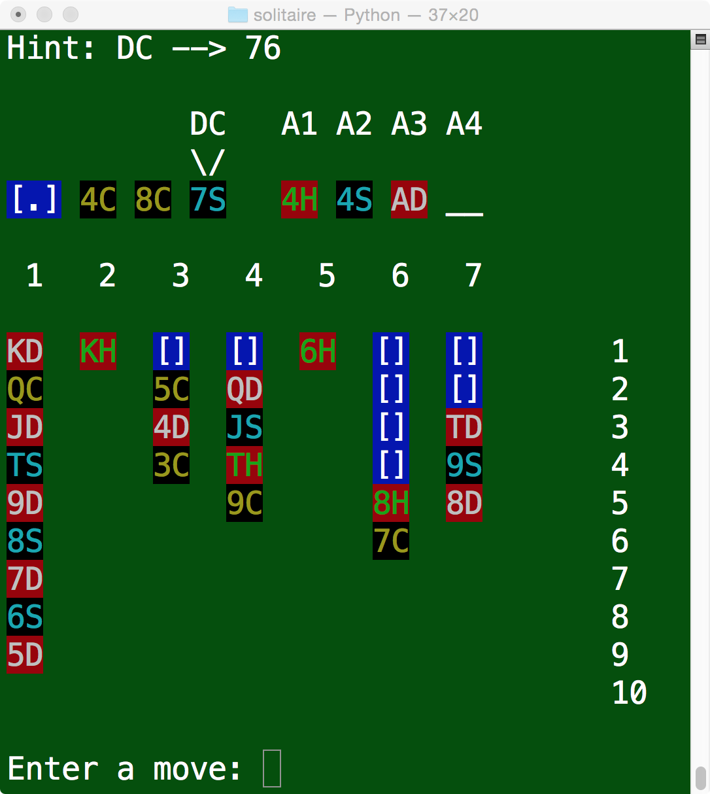

Pyklon: Full-Featured Klondike Solitaire in Python
--------------------------------------------------
By Alex King

Summary
-------
Pyklon is a full-featured Klondike Solitaire engine written in Python. It is 
completely playable (and kind of fun!) in the terminal, but was designed as a 
backend that could power a frontend UI.

Pyklon features a hint engine and complete endgame detection. This means that it
can detect games with no possible moves as well as games with possible but
nonprogressive moves.

Usage and Tips
--------------

Run <code>python main.py</code> at the terminal to play.

Pyklon works by taking in addresses for the source and destination for any 
given move. The seven columns (tableaus) are addressed with numbers 1-7, followed
by a row 1-19. 

The four accumulation stacks (foundations) are addressed as A1, A2, A3 and A4.

The top card of the draw pile is addressed as DC.

Some example moves are "11 22", "DC 54", "32 A3", and "719 111".

Endgame detection in the game requires use of the hint system, which will suggest
possible moves as long as they are unique.

Because movement between two tableaus should always either uncover a card or expose
another, lateral movements between two tableaus are kept track of so that each
unique lateral move will only ever be suggested once. In this way, if the game has no more
useful moves that can uncover cards and advance the game, the hint system may 
suggest that the player move a card stack from
position A to position B, and then back to position A, but after that, it will
recognize that the same should not be attempted again.

In short, if you want to make sure the game detects if you have no more possible
moves, make sure to request a few hints and do the moves that it suggests.

Known Issues and Planned Improvements
-------------------------------------

As of Version 1.1, Pyklon now detects "futile" games, which is a tremendous 
improvement for usability.

Right now, Pyklon does not store any statistics about played games. A future 
update could track wins, losses, and the best time to finish.

Version History and Release Notes
---------------------------------

5/23/15 VERSION 1.1
  - Complete endgame detection added

5/22/15 VERSION 1.0
  - Initial release
